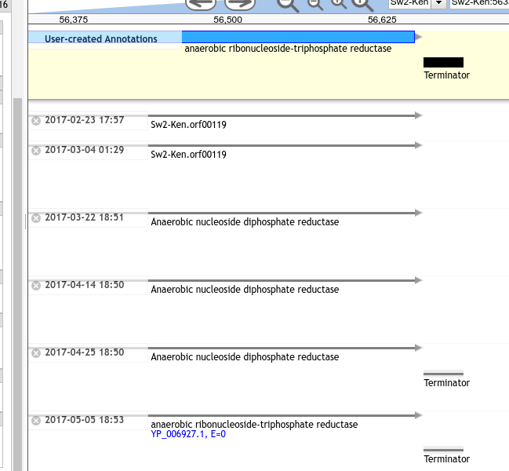

# Apollo Git Backup

This repository contains the scaffolding for creating your own Apollo Git Backup. There are a couple of noteworthy features:

- Backs up fasta and gff3 file in git
- XUnit reports
- Extracts organism directory lineage
- Can convert historical data to JBrowse tracks for visualisations of change over time.

## Tools

### Backup

The backup is straightforward, requireing `python` and `jq`. You will need to install dependencies with pip first:

```
pip install -r requirements.txt
```

Then you can run the backup script with the following:

```
export APOLLO_USERNAME=jane.doe@fqdn.edu
export APOLLO_PASSWORD=password
bash run.sh
```

This will produce a JUnit compatible report.xml. The developers of this project
run it as a cron job in Jenkins and consume the XUnit report to ensure that it
is functioning correctly.

### Lineage

As part of the backup script run, `lineage` files are output. In our Apollo,
due to how the Galaxy/Apollo connector works, we store every single JBrowse
data directory that has ever been associated with an organism. It turns out
that this is incredibly useful. If something goes wrong with a re-generated
trackList, you can easily "downgrade" to a previous "build" of the data
directory. A lineage file simply consists of every folder ID that was used in
chronological order:

```
"/opt/apollo/data/galaxy/106799"
"/opt/apollo/data/galaxy/117811"
"/opt/apollo/data/galaxy/117885"
"/opt/apollo/data/galaxy/125281"
"/opt/apollo/data/galaxy/131198"
"/opt/apollo/data/galaxy/150697"
```

We had an emergency scenario where we discovered that we were dropping tracks
during the re-build of data directories for 20 of our organisms. This was the
incident that initially prompted adding the lineage files data. With the
lineage files in hand, after patching the bug in our build process, we could
simply copy the files forward from the first data dir build to the latest one.

### Historical Data Tracks

As an experiment, we've build a script `history.sh` which works through the
history and updates a JBrowse data directory with each version. This can then
be loaded into a JBrowse instance or an Apollo instance through a simple
`include` in the `trackList.json`.

Here you can see when terminators were added and various rename events
that took place over time:



Another example showing the progression of feature renames over time:


## Setting Up Your Own Backup

If you want to use this repo as a basis for backing up an apollo instance,
great! First: **fork it**. You will need to have your own copy of the repo as
the main build script **commits data to it automatically**

Then, we recommend running it in Jenkins, under an account with commit
privileges to your repo. Over time, this repo will fill up with all of your
changes and you'll be able to go backwards and forwards in time for all facets
of annotation, not just structural model changes.

## License

GPLv3

(Remember that you're running it on your own server and probably not
distributing it to anyone, thus there's no need to share if you don't want to.)

## Support

This material is based upon work supported by the National Science Foundation under Grant Number (Award 1565146)
